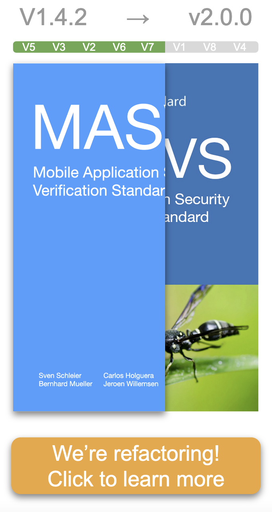

---

layout: col-sidebar
title: OWASP Mobile Application Security
tags: mas
level: 4
url: "https://www2.owasp.org/www-project-mobile-security-testing-guide/"
type: documentation
pitch: The OWASP Mobile Application Security (MAS) project consists of a series of documents that establish a security standard for mobile apps and a comprehensive testing guide that covers the processes, techniques, and tools used during a mobile application security assessment, as well as an exhaustive set of test cases that enables testers to deliver consistent and complete results.

---

 

## Our Mission

### "Define the industry standard for mobile application security."

This OWASP flagship project provides a security standard for mobile apps (OWASP MASVS) and a comprehensive testing guide (OWASP MASTG) that covers the processes, techniques, and tools used during a mobile app security test, as well as an exhaustive set of test cases that enables testers to deliver consistent and complete results.

   

## Trusted by ...

The OWASP MASVS and MSTG are trusted by the following platform providers and standardization, governmental and educational institutions. [Learn more](https://github.com/OWASP/owasp-mstg/blob/master/Document/0x02b-MASVS-MSTG-Adoption.md).

 

## Main Deliverables

 

### OWASP Mobile Application Security Verification Standard (MASVS)

The OWASP MASVS is a standard for mobile app security. It can be used by mobile software architects and developers seeking to develop secure mobile applications, as well as security testers to ensure completeness and consistency of test results.

 

- <a href="https://github.com/OWASP/owasp-masvs/"> GitHub Repo</a>
- 📖 [Read the MASVS on Gitbook](https://mobile-security.gitbook.io/masvs/) (English Version, see more languages [here](https://github.com/OWASP/owasp-masvs#masvs-translations))
- ⬇️ [Download the latest PDF](https://github.com/OWASP/owasp-masvs/releases/latest)

    

### OWASP Mobile Application Security Testing Guide (MASTG)

The OWASP MASTG is a comprehensive manual for mobile app security testing and reverse engineering. It describes technical processes for verifying the controls listed in the [OWASP Mobile Application Verification Standard (MASVS)](https://github.com/OWASP/owasp-masvs).

 

- <a href="https://github.com/OWASP/owasp-mstg/"> GitHub Repo</a>
- 📖 [Read it on Gitbook](https://mobile-security.gitbook.io/mobile-security-testing-guide/)
- ⬇️ [Download the latest PDF](https://github.com/OWASP/owasp-mstg/releases/latest)

 

Feel free to [download the EPUB or Mobi](https://leanpub.com/mobile-security-testing-guide) for any amount you like. All funds raised through sales of this book go directly into the project budget and will be used to for technical editing and designing the book and fund production of future releases.

  

### Mobile App Security Checklist

A checklist is available for use in security assessments based on the MASVS and MSTG. It contains links to the MSTG test case for each MASVS requirement.

- <a href="https://github.com/OWASP/owasp-mstg/releases/latest"> GitHub Repo (MASTG Releases)</a>

Its features include:

- Unifies all MASVS categories into a single sheet
- Traceable via exact MASVS and MSTG versions and commit IDs
- Always up to date with the latest MSTG and MASVS versions
- Enables user to add more columns or sheets as needed
- Multi language

  

## 🥇 MSTG Advocates

MSTG Advocates are industry adopters of the OWASP MASVS and MSTG who have invested a significant and consistent amount of resources to push the project forward by providing consistent high-impact contributions and continuously spreading the word. [Learn more](https://github.com/OWASP/owasp-mstg/blob/master/Document/0x02c-Acknowledgements.md#our-mstg-advocates).

 

  

## Donators

While both the MASVS and the MSTG are created and maintained by the community on a voluntary basis, sometimes a little bit of outside help is required. We therefore thank our donators for providing the funds to support us on our project activities. The Donation Packages are described on the [Donation page](https://github.com/OWASP/owasp-mstg/blob/master/docs/donate.md).

**The OWASP Foundation is very grateful for the support by the individuals and organizations listed. However please note, the OWASP Foundation is strictly vendor neutral and does not endorse any of its supporters. Donations do not influence the content of the MASVS or MSTG in any way.**

  

  

## Archive

These projects are not part of the OWASP MAS project. Please contact the project leaders if you have any questions.

| Project | Project Leaders | Description | Last Release |
| --- | ----- | ----------------- | --- |
| [Android CK](https://github.com/Flo354/Androick) | Florian Pradines | A python tool to help in forensics analysis on android. | 2014 |
| [Damn Vulnerable iOS Application](https://damnvulnerableiosapp.com/) | Prateek Gianchandani | An iOS application that is damn vulnerable. Its main goal is to provide a platform to mobile security enthusiasts/professionals or students to test their iOS penetration testing skills in a legal environment. | 2018 |
| [iGoat Tool Project](https://wiki.owasp.org/index.php/OWASP_iGoat_Tool_Project) | Swaroop Yermalkar | A learning tool for iOS developers (iPhone, iPad, etc.). It was inspired by the WebGoat project, and has a similar conceptual flow to it. | 2017 |
| [Mobile Top Ten](https://wiki.owasp.org/index.php/OWASP_Mobile_Top_10) | Jason Haddix, Daniel Miessler, Jonathan Carter, Milan Singh Thakur | The OWASP Mobile Security top 10 is created to raise awareness for the current mobile security issues. Note that this project has not been migrated yet: See this archive site and this archive site for the older resources. | 2016 |
| [Seraphimdroid](https://owasp.org/www-project-seraphimdroid/) | Nikola Milosevic, Kartik Kholi | A privacy and security protection app for Android devices. | 2016 |
