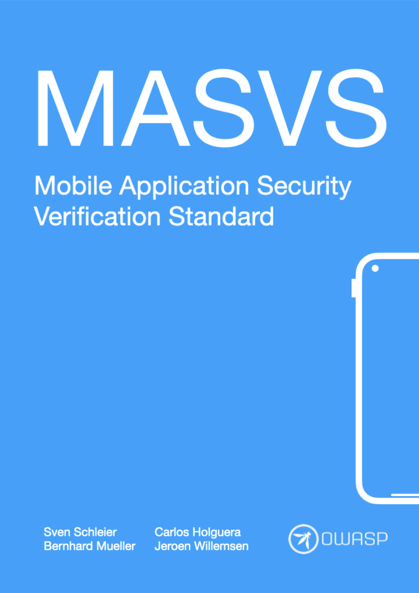
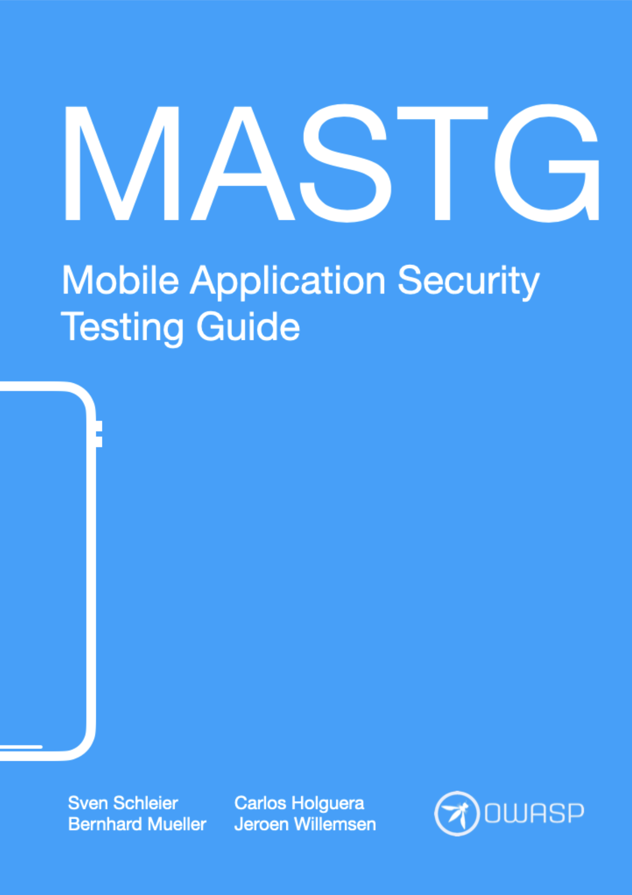
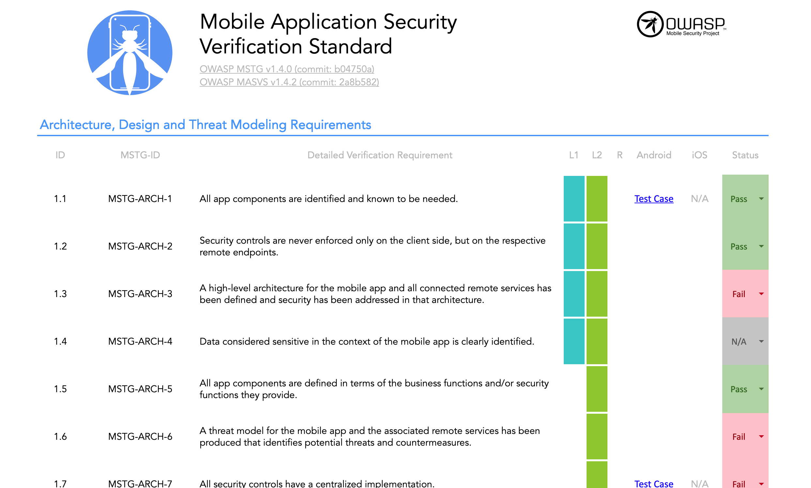
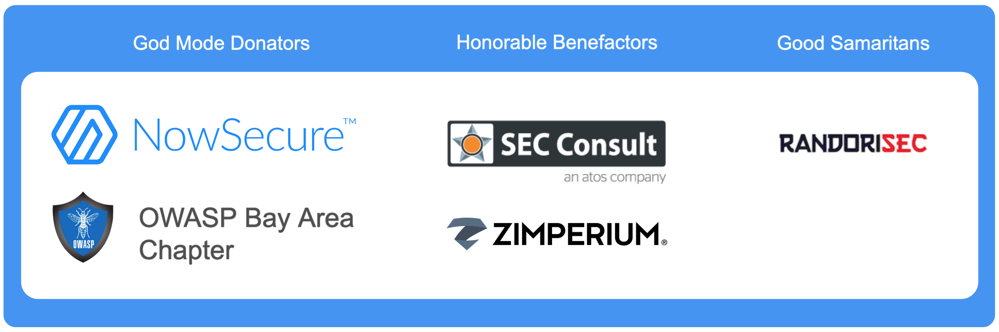

---

layout: col-sidebar
title: OWASP Mobile Application Security
tags: mas
level: 4
url: "https://owasp.org/www-project-mobile-app-security/"
type: documentation
pitch: The OWASP Mobile Application Security (MAS) project consists of a series of documents that establish a security standard for mobile apps and a comprehensive testing guide that covers the processes, techniques, and tools used during a mobile application security assessment, as well as an exhaustive set of test cases that enables testers to deliver consistent and complete results.

---

 

## Our Mission

### "Define the industry standard for mobile application security."

The OWASP Mobile Application Security (MAS) flagship project provides a security standard for mobile apps (OWASP MASVS), a comprehensive testing guide (OWASP MASTG) and a checklist bringing everything together. Together they provide  that covers during a mobile app security assessment in order to deliver consistent and complete results.

All the information about OWASP MAS can be found in the [official website](https://mas.owasp.org/). There you can also read both the MASVS and the MASTG.

 

<a href="https://mas.owasp.org/" class="cta-button">Open the MAS Website</a>

  

## Trusted by ...

The OWASP MASVS and MASTG are trusted by the following platform providers and standardization, governmental and educational institutions. [Learn more](https://mas.owasp.org/MASTG/Intro/0x02b-MASVS-MASTG-Adoption/).

 

## 🥇 MAS Advocates

MAS Advocates are industry adopters of the OWASP MASVS and MASTG who have invested a significant and consistent amount of resources to push the project forward by providing consistent high-impact contributions and continuously spreading the word. [Learn more](https://mas.owasp.org/MASTG/Intro/0x02c-Acknowledgements/#our-mas-advocates).

 

  

## Main Deliverables

 

### OWASP MASVS

The OWASP Mobile Application Security Verification Standard (MASVS) is the industry standard for mobile app security. It can be used by mobile software architects and developers seeking to develop secure mobile applications, as well as security testers to ensure completeness and consistency of test results.

 

- <a href="https://github.com/OWASP/owasp-masvs/"> GitHub Repo</a>
- 📖 [Read it](https://mas.owasp.org/MASVS/)
- ⬇️ [Download the latest PDF](https://github.com/OWASP/owasp-masvs/releases/latest)

    

### OWASP MASTG

_Previously known as OWASP MSTG (Mobile Security Testing Guide)_

The OWASP Mobile Application Security Testing Guide (MASTG) is a comprehensive manual for mobile application security testing. A fundamental learning resource for both beginners and professionals covering a variety of topics from mobile OS internals to advanced reverse engineering techniques.

It also provides an exhaustive set of test cases to be used for verifying the controls listed in the OWASP MASVS, including all relevant guidance and detailed information about the technical processes, techniques and tools.

 

- <a href="https://github.com/OWASP/owasp-mastg/"> GitHub Repo</a>
- 📖 [Read it](https://mas.owasp.org/MASTG/)
- ⬇️ [Download the latest PDF](https://github.com/OWASP/owasp-mastg/releases/latest)

 

Feel free to [download the EPUB or Mobi](https://leanpub.com/mobile-security-testing-guide) for any amount you like. All funds raised through sales of this book go directly into the project budget and will be used to for technical editing and designing the book and fund production of future releases.

  

### Mobile Application Security Checklist

The Mobile Application Security Checklist can be used to apply the MASVS controls during security assessments as it conveniently links to the corresponding MASTG test cases.

- <a href="https://github.com/OWASP/owasp-mastg/releases/latest"> GitHub Repo (MASTG Releases)</a>

Its features include:

- Unifies all MASVS categories into a single sheet
- Traceable via exact MASVS and MASTG versions and commit IDs
- Always up to date with the latest MASTG and MASVS versions
- Enables user to add more columns or sheets as needed
- Multi language

  

## Donators

While both the MASVS and the MASTG are created and maintained by the community on a voluntary basis, sometimes a little bit of outside help is required. We therefore thank our donators for providing the funds to support us on our project activities. The Donation Packages are described on the [Donation page](https://mas.owasp.org/donate/).

**The OWASP Foundation is very grateful for the support by the individuals and organizations listed. However please note, the OWASP Foundation is strictly vendor neutral and does not endorse any of its supporters. Donations do not influence the content of the MASVS or MASTG in any way.**

  

  

### Presentations

You can find a list of our talks in our [Talks page in GitHub](https://mas.owasp.org/talks/).
