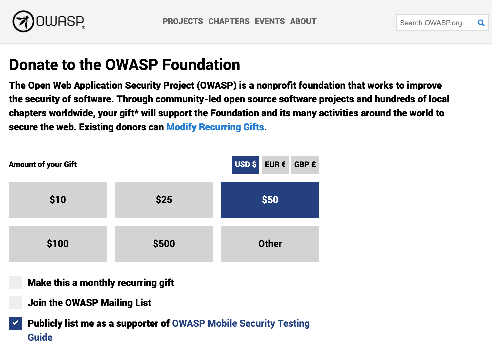

# Donations

If you'd like to support the Mobile Security Testing project we'll be happy to accept your donations. You may donate 5, 500, 5000 (UDS/EUR/GBP) or any custom amount. Certain amounts allow you to opt-in for a "[Donation Package](#donation-packages)" (see below).

100% of the funds raised go directly to the OWASP foundation and allow us to ask for budget to fund our project activities:

- Editing and proofreading by professional editors.
- Graphic design and layout improvements.
- Improving our automated delivery pipelines.
- Acquiring new test devices if certain tests can not be executed on existing emulators/simulators/test devices.

**You may do an online donation directly from the OWASP website by clicking the DONATE button above.**

When you click on the DONATE button and fill in the form be sure to verify that it has the line:
"Publicly list me as a supporter of OWASP Mobile Security Testing Guide"

> Please note that the OWASP Donation Policy has changed since 22-Sept-2020. All details can be found in [OWASP Donations Policy](https://owasp.org/www-policy/operational/donations) page.

## Donation Packages

If you'd like to opt-in for a Donation Package please contact [Sven Schleier](mailto:sven.schleier@owasp.org) or [Carlos Holguera](mailto:carlos.holguera@owasp.org) to verify your donation. We will then, together with the OWASP Foundation verify and process it.

> These types of public recognition shall be online no less than one year, or in the case of Project no less than the next major release, whichever is greater. Some Donation Packages have a maximum duration, once reached the logos will be removed and the donator will still be listed as supporter on the project website, GitHub and in the printed and digital versions. This can be renewed anytime.

### Good Samaritan (USD 500)

- Listed as supporter on the project website and GitHub.
- Listed as supporter in the printed and digital versions (without logo).
- Duration: 1 year
- Optional: 1 Paperback Book

### Honourable Benefactor (USD 2,000 / 8 Available)

- Small company logo in the “Honourable Benefactors” section on project website and Github.
- Small company logo on the supporter page of the printed and digital versions.
- Duration: 2 years
- Optional: 3 Paperback Books

### God Mode Donator (USD 4,000 / 5 Available)

- Large company logo in the “God mode donators section on project website and Github.
- Large company logo on the supporter page of the printed and digital versions.
- Duration: 3 years
- Optional: 5 Paperback Books

## Other Forms of Donation

If you still want to help out the project you can always contribute with content for the MASVS or the MSTG and end up at our [acknowledgement section](https://github.com/OWASP/owasp-mstg/blob/master/Document/0x02-Frontispiece.md#acknowledgments "MSTG acknowledgements") or you can buy digital copies of the MSTG at [Leanpub](https://leanpub.com/mobile-security-testing-guide "MSTG at Leanpub"). Donators can be mentioned in the acknowledgement section as well, from 25 USD onward. Note that you are anonymous to us when you buy via Leanpub. Therefore, if you want to get listed, submit your payment receipt to [Sven Schleier](mailto:sven.schleier@owasp.org) or [Carlos Holguera](mailto:carlos.holguera@owasp.org).
