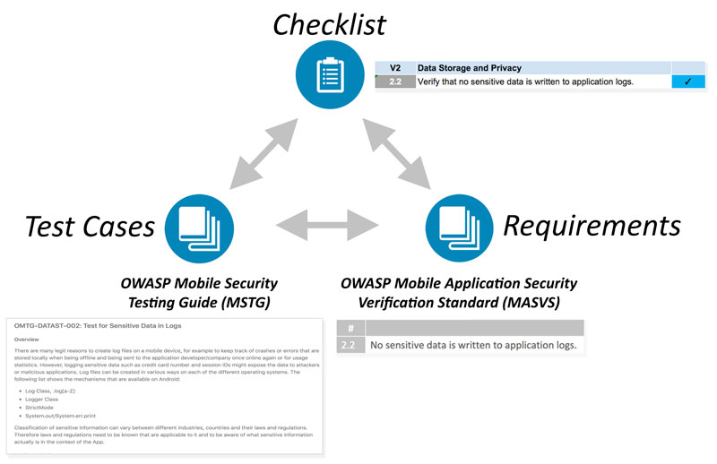
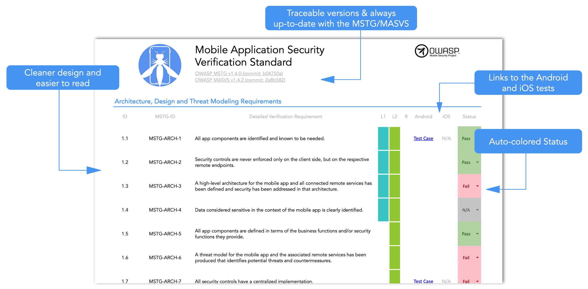

# How-Tos

## Using the OWASP Mobile App Security Verification Standard, Testing Guide and Checklist

The documents produced in this project cover many aspects of mobile application security, from the high-level requirements to the nitty-gritty implementation details and test cases. They can be used to plan and verify security controls during any phase of mobile app development, as well as during pre-release code review and penetration testing.

1. The [Mobile Application Security Verification Standard (MASVS)](https://github.com/OWASP/owasp-masvs/releases) contains generic security requirements along with mappings to verification levels that can be chosen depending on the overall need for security.
2. The [Mobile Security Testing Guide (MSTG)](https://github.com/OWASP/owasp-mstg/releases) provides verification instructions for each requirement in the MASVS, as well as security best practices for apps on each supported mobile operating system (currently Android and iOS). It is also useful as a standalone learning resource and reference guide for mobile application security testers.
3. The [Mobile App Security Checklist](https://github.com/OWASP/owasp-mstg/releases/latest) can be used to apply the MASVS requirements during practical assessments. It also conveniently links to the MSTG test case for each requirement, making mobile penetration testing a breeze.

It is important to note that the security standard, testing guide and checklists are closely related: They all map to the same basic set of requirements. Depending on the context, the documents can be used stand-alone or in combination to achieve different objectives.

For example, the MASVS requirements may be used in the planning and architecture design stages, while the checklist and testing guide may serve as a baseline for manual security testing or as a template for automated security tests.

## Mobile App Security Testing

The [checklist](https://github.com/OWASP/owasp-mstg/releases/latest) works great as a reference during mobile app security assessments. You can walk through the requirements one-by-one - for more information on how to test each requirement, simply click on the links in the "Android" and "iOS" columns. Or, fill out the checklist at the end of an assessment to ensure completeness.

## Security Engineering in the SDLC

Properly defined security requirements are an important part of the Secure SDLC. The [MASVS](https://github.com/OWASP/owasp-masvs/releases/download/0.9.2/OWASP_Mobile_AppSec_Verification_Standard_v0.9.2.pdf) levels can be used along with threat modeling to determine the appropriate set of security controls for a particular mobile app. MASVS V1 also lists requirements pertaining to the architecture and design of the mobile apps, as well as general processes and activities that should be part of the development process.

## Mobile App Security Education

The [Mobile Security Testing Guide](https://github.com/OWASP/owasp-mstg) can be used as a standalone learning resource. Its main chapters contain general how-tos and tutorials that cover a variety of topics from mobile OS internals to advanced reverse engineering techniques.
